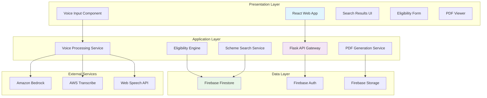

# Design Document: Jan-Sahayak Government Scheme Assistant

## Overview

Jan-Sahayak implements a three-tier architecture designed for scalability, maintainability, and government-grade security. The system leverages modern cloud services to provide Kannada voice search, intelligent eligibility checking, and automated document generation for government scheme assistance.

The architecture separates concerns across three distinct layers:
- **Presentation Layer**: React-based web application providing multilingual UI
- **Application Layer**: Python Flask API handling business logic and AI integration
- **Data Layer**: Firebase Firestore for scheme data with integrated authentication

## Architecture



## Components and Interfaces

### Frontend Components (React)

**VoiceSearchComponent**
- Integrates Web Speech API for Kannada voice recognition
- Provides fallback text input when voice is unavailable
- Handles audio permission requests and error states
- Interface: `onVoiceResult(text: string, confidence: number)`

**SchemeSearchResults**
- Displays paginated search results with relevance ranking
- Supports filtering by category, department, and eligibility
- Provides scheme preview with key details
- Interface: `displaySchemes(schemes: SchemeResult[], totalCount: number)`

**EligibilityWizard**
- Multi-step form for collecting user eligibility data
- Dynamic field rendering based on scheme requirements
- Real-time validation with user-friendly error messages
- Interface: `onEligibilitySubmit(userData: UserProfile, schemeId: string)`

**PDFDownloadManager**
- Handles PDF generation requests and download management
- Shows generation progress and provides retry mechanisms
- Supports multiple document formats and languages
- Interface: `generatePDF(schemeId: string, userProfile: UserProfile)`

### Backend Services (Python Flask)

**VoiceProcessingService**
```python
class VoiceProcessingService:
    def process_kannada_voice(self, audio_data: bytes) -> VoiceResult:
        # Primary: AWS Transcribe for Kannada speech-to-text conversion
        # Fallback: Web Speech API for browser-based recognition
        # Handles dialect variations and provides confidence scores
        pass
    
    def enhance_search_query(self, raw_text: str) -> SearchQuery:
        # Uses Amazon Bedrock to understand intent and extract entities
        # Maps colloquial terms to formal scheme categories
        # Handles synonyms and regional language variations
        pass
    
    def validate_transcription_quality(self, transcription: str, confidence: float) -> bool:
        # Uses Bedrock to validate transcription quality
        # Checks for common transcription errors in Kannada
        # Returns whether transcription is reliable enough for search
        pass
```

**EligibilityEngine**
```python
class EligibilityEngine:
    def check_eligibility(self, user_profile: UserProfile, scheme_id: str) -> EligibilityResult:
        # Evaluates user data against Firebase-stored criteria
        # Provides detailed feedback on qualification status
        # Handles complex multi-criteria evaluations
        pass
    
    def get_missing_requirements(self, user_profile: UserProfile, scheme_id: str) -> List[Requirement]:
        # Identifies gaps in user-provided information
        # Suggests additional documents or data needed
        # Prioritizes requirements by importance
        pass
```

**PDFGenerationService**
```python
class PDFGenerationService:
    def generate_checklist(self, scheme_id: str, user_profile: UserProfile) -> PDFDocument:
        # Creates personalized application checklists
        # Includes scheme-specific requirements and deadlines
        # Formats documents in Kannada with proper typography
        pass
    
    def generate_application_guide(self, scheme_id: str) -> PDFDocument:
        # Produces step-by-step application instructions
        # Includes contact information and help resources
        # Supports multiple output formats (PDF, HTML)
        pass
```

### Data Models

**Scheme Document (Firestore)**
```typescript
interface SchemeDocument {
    id: string;
    name: {
        kannada: string;
        english: string;
    };
    description: {
        kannada: string;
        english: string;
    };
    department: string;
    category: string[];
    eligibilityCriteria: EligibilityCriterion[];
    requiredDocuments: Document[];
    applicationDeadline?: Date;
    benefitAmount?: number;
    isActive: boolean;
    lastUpdated: Date;
    version: number;
}

interface EligibilityCriterion {
    field: string;
    operator: 'equals' | 'greaterThan' | 'lessThan' | 'contains' | 'range';
    value: any;
    description: {
        kannada: string;
        english: string;
    };
}
```

**User Profile**
```typescript
interface UserProfile {
    sessionId: string;
    age?: number;
    gender?: 'male' | 'female' | 'other';
    income?: number;
    location: {
        district: string;
        taluk: string;
        village?: string;
    };
    caste?: string;
    occupation?: string;
    familySize?: number;
    hasDisability?: boolean;
    educationLevel?: string;
    landOwnership?: number;
    createdAt: Date;
    expiresAt: Date;
}
```

## Data Models

### Firebase Firestore Collections

**schemes** - Government scheme information
- Indexed by: category, department, isActive, lastUpdated
- Security rules: Read-only for authenticated users, write for admins only
- Supports real-time updates for scheme modifications

**eligibility_cache** - Cached eligibility results for performance
- TTL: 1 hour for user sessions
- Indexed by: sessionId, schemeId, timestamp
- Automatically cleaned up after expiration

**user_sessions** - Temporary user data for eligibility checking
- TTL: 30 minutes of inactivity
- Encrypted sensitive fields (income, personal details)
- No persistent storage of personal information

**audit_logs** - System activity tracking
- Immutable records of all data access and modifications
- Retention: 7 years for compliance
- Indexed by: timestamp, action, userId

## Correctness Properties

*A property is a characteristic or behavior that should hold true across all valid executions of a system—essentially, a formal statement about what the system should do. Properties serve as the bridge between human-readable specifications and machine-verifiable correctness guarantees.*

### Voice Search Properties

**Property 1: Voice search performance**
*For any* user activation of voice search, the system should respond with audio input prompt within 2 seconds and complete Kannada speech conversion within 5 seconds
**Validates: Requirements 1.1, 1.2**

**Property 2: Voice search accuracy and fallback**
*For any* Kannada speech input, the system should produce relevant search results using AWS Transcribe as primary service and Web Speech API as fallback, and for any invalid or unclear audio, should request repetition or provide text search fallback
**Validates: Requirements 1.3, 1.4, 1.5**

**Property 3: Kannada dialect support**
*For any* common Kannada dialect or regional variation, AWS Transcribe should successfully recognize and convert speech to searchable text, with Bedrock validation ensuring transcription quality
**Validates: Requirements 1.6**

### Eligibility Verification Properties

**Property 4: Eligibility checking performance and accuracy**
*For any* scheme selection and user information submission, the system should validate eligibility within 3 seconds and provide accurate status (eligible/ineligible) with appropriate next steps or specific reasons
**Validates: Requirements 2.1, 2.2, 2.3, 2.4**

**Property 5: Incomplete data handling**
*For any* incomplete user profile, the eligibility checker should identify all missing required information and request it from the user
**Validates: Requirements 2.5**

**Property 6: Offline eligibility verification**
*For any* Firebase connectivity loss, the system should continue eligibility verification using cached rules without degradation of core functionality
**Validates: Requirements 2.7**

### PDF Generation Properties

**Property 7: PDF generation completeness**
*For any* eligible user profile, the PDF generator should create a personalized checklist containing all required documents, step-by-step Kannada instructions, and administrator contact information
**Validates: Requirements 3.1, 3.2, 3.3, 3.7**

**Property 8: PDF formatting and performance**
*For any* PDF generation request, the system should produce A4-formatted documents and provide download links within 10 seconds, or offer alternatives if generation fails
**Validates: Requirements 3.4, 3.5, 3.6**

### Data Management Properties

**Property 9: Scheme data integrity**
*For any* scheme addition or modification, the system should validate required fields, maintain bilingual content, preserve version history, and immediately reflect changes in search results
**Validates: Requirements 4.1, 4.2, 4.3, 4.4**

**Property 10: Scheme lifecycle management**
*For any* scheme expiration or discontinuation, the system should mark it inactive while preserving historical data and maintaining proper categorization
**Validates: Requirements 4.5, 4.6**

### User Interface Properties

**Property 11: UI responsiveness and language support**
*For any* user interface interaction, the system should display content in Kannada script, provide visual feedback within 1 second, and support both touch and keyboard navigation
**Validates: Requirements 5.1, 5.2, 5.3**

**Property 12: Error messaging and accessibility**
*For any* error condition, the system should display helpful messages in simple Kannada, and when accessibility features are enabled, should support screen readers and high contrast modes
**Validates: Requirements 5.4, 5.6**

### Security and Privacy Properties

**Property 13: Data protection**
*For any* personal information handling, the system should encrypt data in transit and at rest, request only necessary information, and automatically delete session data after 30 minutes of inactivity
**Validates: Requirements 6.1, 6.2, 6.3**

**Property 14: Data deletion and breach response**
*For any* user data deletion request, the system should remove all personal information within 24 hours, and for any detected breach, should immediately notify administrators and affected users
**Validates: Requirements 6.4, 6.6**

### Performance and Reliability Properties

**Property 15: System performance under load**
*For any* standard mobile network connection, the system should load within 3 seconds, cache frequently accessed information during poor connectivity, and prioritize core functions during high system load
**Validates: Requirements 7.1, 7.2, 7.4**

**Property 16: Concurrent user support and error logging**
*For any* system operation with up to 10,000 concurrent users, the system should maintain functionality and log detailed error information for troubleshooting while protecting user privacy
**Validates: Requirements 7.5, 7.6**

### Integration Properties

**Property 17: Government system integration**
*For any* government identity verification request, the system should successfully integrate with existing systems and provide APIs for other government portals
**Validates: Requirements 8.1, 8.4**

**Property 18: Data synchronization and resilience**
*For any* scheme data changes in source systems, the system should synchronize updates within 24 hours, continue operating with cached data during integration failures, and maintain audit logs of all synchronization activities
**Validates: Requirements 8.2, 8.5, 8.6**

**Property 19: Cross-platform compatibility**
*For any* standard web browser on desktop or mobile devices, the system should provide full functionality and consistent user experience
**Validates: Requirements 8.3**

## Error Handling

### Voice Processing Errors
- **AWS Transcribe Unavailable**: Fallback to Web Speech API with reduced accuracy warnings
- **Audio Permission Denied**: Gracefully fallback to text search with clear user guidance
- **Network Timeout**: Cache recent transcription models locally for offline processing
- **Unsupported Audio Format**: Provide format conversion or alternative input methods
- **Transcription Confidence Low**: Use Bedrock validation to request user confirmation or re-recording
- **Bedrock Service Unavailable**: Use cached language models with reduced query enhancement

### Eligibility Verification Errors
- **Firebase Connection Loss**: Switch to cached eligibility rules with staleness indicators
- **Incomplete User Data**: Progressive disclosure of required fields with helpful explanations
- **Validation Failures**: Specific error messages in Kannada with correction suggestions
- **Concurrent Access Conflicts**: Implement optimistic locking with retry mechanisms

### PDF Generation Errors
- **Template Corruption**: Fallback to basic text format with manual formatting instructions
- **Storage Quota Exceeded**: Implement cleanup policies and user notification
- **Font Rendering Issues**: Provide alternative fonts while maintaining Kannada readability
- **Generation Timeout**: Offer simplified document versions or email delivery options

## Testing Strategy

### Dual Testing Approach

The Jan-Sahayak system requires comprehensive testing through both unit tests and property-based tests to ensure reliability for government service delivery.

**Unit Testing Focus:**
- Specific examples of voice recognition with known Kannada phrases
- Edge cases for eligibility criteria (boundary conditions, missing data)
- Integration points between React components and Flask API
- Error conditions and recovery scenarios
- PDF template rendering with various user profiles

**Property-Based Testing Focus:**
- Universal properties that hold across all user inputs and system states
- Comprehensive input coverage through randomized test generation
- Performance characteristics under varying load conditions
- Data integrity across all CRUD operations
- Security properties for all data handling scenarios

**Property-Based Testing Configuration:**
- **Framework**: Hypothesis for Python backend, fast-check for TypeScript frontend
- **Test Iterations**: Minimum 100 iterations per property test
- **Tagging Format**: Each test tagged with `Feature: jan-sahayak, Property {number}: {property_text}`
- **Coverage Requirements**: Each correctness property implemented by exactly one property-based test

**Testing Infrastructure:**
- **Backend**: pytest with Hypothesis for property-based testing
- **Frontend**: Jest with fast-check for React component property testing
- **Integration**: Cypress for end-to-end user journey validation
- **Performance**: Artillery for load testing with realistic user patterns
- **Security**: OWASP ZAP for automated security scanning
- **AWS Services**: Moto for mocking AWS Transcribe and Bedrock in tests

**Test Data Management:**
- **Synthetic Data**: Generate realistic Kannada names, addresses, and demographic data
- **Scheme Data**: Maintain test database with representative government schemes
- **Audio Samples**: Curated collection of Kannada speech samples across dialects for AWS Transcribe testing
- **User Profiles**: Diverse test profiles covering all eligibility scenarios
- **Mock Responses**: Pre-recorded AWS Transcribe and Bedrock responses for consistent testing

The testing strategy ensures that both specific examples work correctly (unit tests) and that universal properties hold across all possible inputs (property tests), providing comprehensive coverage for a government-critical application.